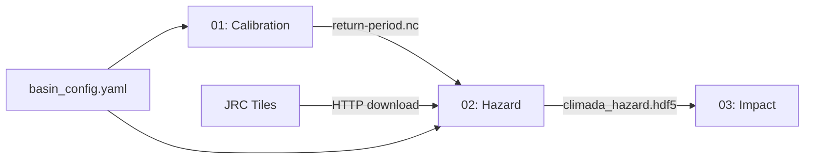

# 09 — Documentation and Communication

## Every Section Needs a Markdown Cell Explaining WHAT and WHY

Code cells say HOW. Markdown cells say WHAT (purpose) and WHY (reasoning). Without markdown, a notebook is just a script with extra steps.

### ✅ Good: narrative before code

```markdown
## Section 4: Merge JRC Flood Map Tiles

We download JRC Global Flood Maps as individual tiles (one per degree grid cell).
This section merges overlapping tiles into a single continuous raster covering the
area of interest, then clips to the basin boundary.

**Why merge here (not in src/)?** — The merge logic is tile-format-specific and
only used in this notebook. If JRC changes tile format, only this cell changes.
```

### ❌ Bad: code with no context

```python
# No markdown cell — reader has no idea why this is happening
tiles = list(tile_dir.glob("*.tif"))
merged = merge(tiles)
clipped = clip(merged, boundary)
```

## Use Markdown Headers for Notebook Table of Contents

Headers (`##`) create entries in the notebook's table of contents sidebar. Structure sections like a report:

```markdown
## 0. Environment Setup
## 0.5 Helper Functions
## 1. Configuration
## 2. Load Return Period Data
## 3. Download JRC Flood Maps
## 4. Merge and Clip Tiles
## 5. Regrid to Matching Resolution
## 6. Create CLIMADA Hazard Object
## 7. Summary and Next Steps
## 8. Visualization
```

This means a reader can jump to any section without scrolling through 200 cells.

## Prerequisites Cell at the Top

The very first markdown cell should state what must exist before running this notebook. Don't make the reader discover dependencies by hitting FileNotFoundError on cell 15.

### ✅ Good: explicit prerequisites

```markdown
# Notebook 02: Hazard-Only Workflow

## Purpose
Create flood hazard maps from calibrated return period data and JRC flood maps.

## Prerequisites
- ✅ Notebook 01 completed successfully
- ✅ File exists: `data/processed/calibration/{BASIN_ID}/{RUN_TAG}/return-period_all.nc`
- ✅ File exists: `data/processed/calibration/{BASIN_ID}/{RUN_TAG}/run_config.json`
- ✅ Environment activated: `conda activate my-analysis`
- ✅ Internet access (for JRC tile download, Section 3 only)

## What This Notebook Does
1. Loads calibrated return period grids (from Notebook 01)
2. Downloads JRC Global Flood Maps for the region
3. Merges and clips flood map tiles
4. Regrids return periods to flood map resolution
5. Creates a CLIMADA-compatible Hazard object

## What This Notebook Does NOT Do
- ❌ Calibration (that's Notebook 01)
- ❌ Impact modeling (that's Notebook 03)
- ❌ Exposure creation (that's a separate workflow)
```

### ❌ Bad: no preamble — reader dives into code blind

```python
# First cell is just imports — no context
import xarray as xr
import numpy as np
```

## Workflow Diagrams

For multi-notebook workflows, show the dependency graph. Either as ASCII art (git-friendly) or Mermaid (renders in VS Code, GitHub).

### ASCII art workflow

```markdown
## Workflow Overview

```
┌──────────────┐     ┌──────────────┐     ┌──────────────┐
│  Notebook 01 │     │  Notebook 02 │     │  Notebook 03 │
│ Calibration  │────▶│ Hazard Maps  │────▶│ Impact Model │
└──────────────┘     └──────────────┘     └──────────────┘
       │                     │                     │
       ▼                     ▼                     ▼
  return-period_all.nc  climada_hazard.hdf5  impact_results.csv
  run_config.json       flood-depth_all.nc   exposure_pts.csv
```
```

### Mermaid (renders on GitHub)

````markdown

````

## Print Progress for Long Operations

Silent processing makes users anxious. Print status updates for anything that takes more than a few seconds.

### ✅ Good: progress feedback

```python
print(f"⬇ Downloading {len(tile_urls)} JRC tiles...")
for i, url in enumerate(tile_urls):
    download_with_cache(url, tile_dir / url.split('/')[-1])
    if (i + 1) % 10 == 0:
        print(f"  {i+1}/{len(tile_urls)} tiles downloaded")
print(f"✓ All {len(tile_urls)} tiles downloaded")
```

### ❌ Bad: silent processing

```python
for url in tile_urls:
    download_with_cache(url, tile_dir / url.split('/')[-1])
# User stares at spinning cursor for 10 minutes with no feedback
```

### Status emoji convention

Use these sparingly and consistently:

| Emoji | Meaning | Example |
|-------|---------|---------|
| ✅ / ✓ | Success / complete | `✓ Loaded: {ds.sizes}` |
| ❌ | Error / failure | `❌ File not found: ...` |
| ⚠️ | Warning / fallback | `⚠️ Low RAM mode activated` |
| ⏳ | In progress | `⏳ Regridding (this takes ~2 min)...` |
| 📊 | Statistics output | `📊 Mean depth: 0.45m` |
| 📂 | File I/O | `📂 Saved: output.nc` |
| ➡️ | Next step | `➡️ Open Notebook 03` |

## Document Assumptions Explicitly

State what you assume about the data, the environment, and the workflow. Assumptions that aren't documented become bugs when they're violated.

### ✅ Good: explicit assumptions

```markdown
## Assumptions

- JRC provides flood maps for 7 return periods: [10, 20, 50, 75, 100, 200, 500]
- All JRC tiles use EPSG:4326 (WGS84 geographic coordinates)
- Flood depth values are in meters (not centimeters)
- The basin boundary polygon is in the same CRS as the flood maps
- Available RAM is ≥4 GB (for merging tiles; uses chunked processing if less)
```

### ❌ Bad: implicit assumptions that cause silent failures

```python
# Assumes JRC always has RP500 — fails silently if it doesn't
rp_500 = flood_maps['RP500']
```

## Separate User Guides from Technical Docs

The reference repo does this well. Different audiences need different documents:

```
docs/
├── getting-started/
│   ├── INSTALLATION.md        # How to set up the environment
│   ├── QUICKSTART.md          # Run your first analysis in 5 minutes
│   └── FAQ.md                 # Troubleshooting common errors
├── user-guides/
│   ├── notebook01-guide.md    # Step-by-step for practitioners
│   ├── notebook02-guide.md
│   └── adding-new-basin.md    # How to extend to a new region
└── technical/
    ├── ARCHITECTURE.md        # System design, module dependencies
    ├── DATA_FORMATS.md        # File schemas, naming conventions
    └── CONTRIBUTING.md        # Dev setup, PR process, coding standards
```

### Who reads what

| Audience | Documents |
|----------|-----------|
| New user (practitioner) | getting-started/, user-guides/ |
| Developer extending the code | technical/, src/ docstrings |
| CI/CD system | README.md installation section |
| Future you (6 months later) | All of the above |

## Write Troubleshooting Sections

Collect common errors and their solutions. The reference repo's FAQ.md is excellent:

```markdown
## FAQ / Troubleshooting

### `FileNotFoundError: return-period_all.nc`
**Cause**: Notebook 01 hasn't been run for this basin yet.
**Fix**: Run Notebook 01 with the same `BASIN_ID` and `RUN_TAG`.

### `MemoryError` during tile merge
**Cause**: Too many tiles loaded at once.
**Fix**: Set `LOW_RAM_MODE = True` in Section 1, or reduce chunk size.

### JRC download returns 403
**Cause**: JRC server rate limiting or maintenance.
**Fix**: Wait 10 minutes and retry. Check https://data.jrc.ec.europa.eu/status.
```

## Summary Cell with Next Steps

End every notebook with a clear "what was produced and what to do next" message:

### ✅ Good: actionable summary

```python
print("=" * 70)
print("SECTION 7: WORKFLOW COMPLETE")
print("=" * 70)

print(f"\n📂 Outputs in: {OUTPUT_DIR}")
for f in sorted(OUTPUT_DIR.glob("*")):
    size_mb = f.stat().st_size / 1e6
    print(f"  • {f.name} ({size_mb:.1f} MB)")

print(f"\n➡️  Next steps:")
print(f"  1. Open Notebook 03 (Impact Modeling)")
print(f"  2. Ensure exposure data exists: data/raw/exposure_{BASIN_ID}.csv")
print(f"  3. Load hazard: Hazard.from_hdf5('{hazard_path.name}')")
```

## For Stakeholder Notebooks: Minimize Code, Maximize Narrative

When creating notebooks for non-technical stakeholders (decision-makers, program managers):

- Hide code cells or use `%%capture` to suppress output
- Lead with narrative and plots
- Use callout boxes for key findings
- End with clear recommendations

```markdown
## Key Finding

> 📊 **A 1-in-100-year flood would inundate 45 km² of the study area,
> affecting an estimated 12,000 households.**
>
> This is 3x larger than the area affected by the 2020 event.
```